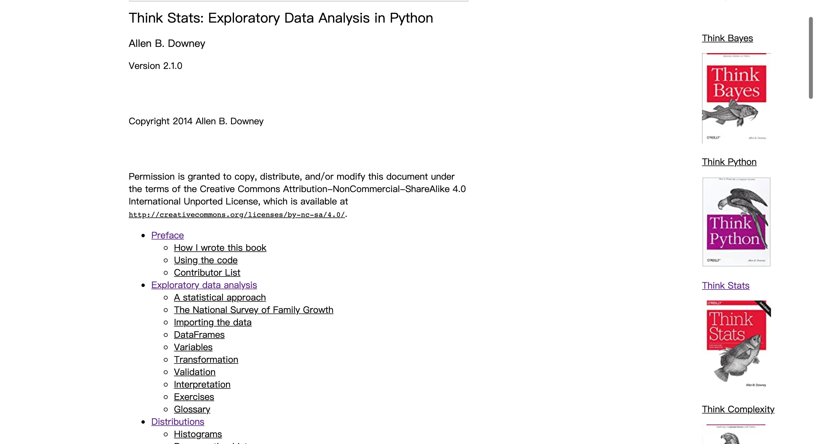
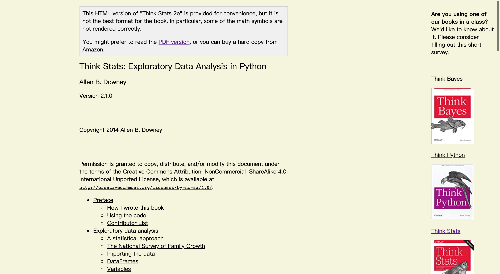

## 用Python获取Think Stats的HTML版本

Think Stats官网：[https://greenteapress.com/wp/think-stats-2e/](https://greenteapress.com/wp/think-stats-2e/)

Think Stats是一本关于数据分析的书，使用的语言为Python，具体我也没开始读，等读完之后在更新这一部分，现在先使用占位符pass(笑)。不过值得一提的是，作者Allen B. Downey写的Think Python写得很好，通俗易懂，适合入门以及进一步深入学习。

官网上只有PDF和HTML版本，我个人不太习惯阅读PDF；Think Stats的HTML版本背景颜色为白色，看久了觉得很别扭，每次看都在控制台修改style又很麻烦，所以就干脆用Python批量下载HTML文件，同时也能直接改背景颜色。

官网上的布局：

我修改后的布局：

尽管修改之后也不算精致，但是修改了背景颜色之后极大的提高了我的阅读体验。

在这个repo中有已经下载好的HTML版本Think Stats，需要的同学可以直接下载。点开index.html之后就可以开始阅读，之后也不用一个个html文件点开，只需要在页面中直接的前进就可以打开下一章。

